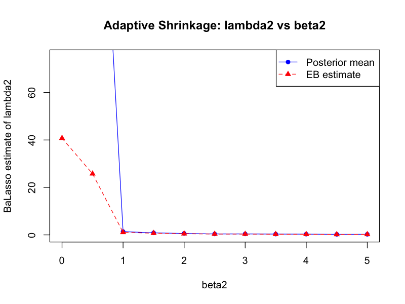
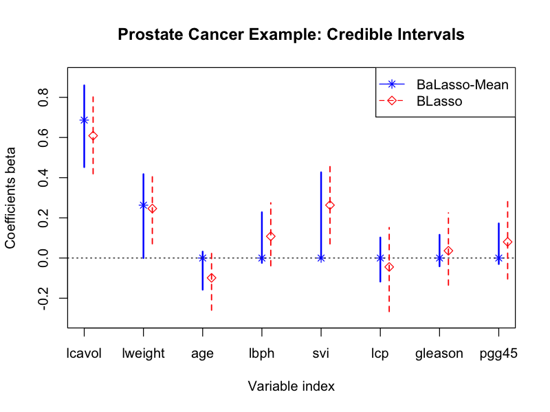

<div align="center">

# BADL

### Bayesian Adaptive Lasso in R

*Pure R · Gibbs sampler from scratch · Hierarchical & Empirical Bayes variants*

[](https://www.r-project.org/)
[](LICENSE)
[](https://doi.org/10.1007/s10463-013-0422-8)

</div>

---

Implementation of the **Bayesian Adaptive Lasso (BaLasso)** from:

> Leng C, Tran M-N, Nott D. *Bayesian adaptive Lasso.* Annals of the Institute of Statistical Mathematics, 2014; 66:221–244.

Unlike the standard Lasso, BaLasso assigns a **coefficient-specific penalty** $\lambda_j$ to each $\beta_j$, enabling automatic variable selection, oracle-rate shrinkage, and full posterior uncertainty quantification.

---

## Mathematical Formulation

### Hierarchical Model

For centered response $y$ and design matrix $X$:

$$
y \mid X, \beta, \sigma^2 \sim N_n(X\beta,\; \sigma^2 I_n)
$$

$$
\beta \mid \sigma^2, \tau_1^2, \dots, \tau_p^2 \sim N_p\!\left(0_p,\; \sigma^2 D_\tau\right), \quad D_\tau = \text{diag}(\tau_1^2, \dots, \tau_p^2)
$$

With adaptive priors:

$$
\sigma^2 \sim \pi(\sigma^2) \propto 1/\sigma^2
$$

$$
\tau_j^2 \mid \lambda_j^2 \sim \text{Exponential}(\lambda_j^2 / 2), \quad j = 1, \dots, p
$$

$$
\lambda_j^2 \sim \text{Gamma}(r, \delta), \quad j = 1, \dots, p
$$

Integrating out $\tau_j^2$, the marginal prior on $\beta_j \mid \sigma^2$ is Laplace with coefficient-specific penalty $\lambda_j$:

$$
\pi(\beta_j \mid \sigma^2) = \frac{\lambda_j}{2\sqrt{\sigma^2}}\, e^{-\lambda_j |\beta_j| / \sqrt{\sigma^2}}
$$

### Gibbs Sampler Full Conditionals

| Step | Distribution |
| :--- | :--- |
| $\beta \mid y, \sigma^2, \tau^2$ | $N\!\left(A^{-1}X^\top y,\; \sigma^2 A^{-1}\right)$, $\;A = X^\top X + D_\tau^{-1}$ |
| $\sigma^2 \mid y, \beta, \tau^2$ | $\text{Inv-Gamma}\!\left(\tfrac{n-1+p}{2},\; \tfrac{\lVert y - X\beta \rVert^2 + \beta^\top D_\tau^{-1}\beta}{2}\right)$ |
| $1/\tau_j^2 \mid \beta_j, \sigma, \lambda_j$ | $\text{Inv-Gaussian}\!\left(\tfrac{\lambda_j \sigma}{\lvert\beta_j\rvert},\; \lambda_j^2\right)$ |
| $\lambda_j^2 \mid \tau_j^2$ *(HB)* | $\text{Gamma}\!\left(1 + r,\; \tfrac{\tau_j^2}{2} + \delta\right)$ |
| $\lambda_j$ *(EB / Atchadé SA)* | $\lambda_j = e^{s_j}$, $\;s_j^{(t)} = s_j^{(t-1)} + a_t\!\left(2 - e^{2s_j^{(t-1)}}\tau_j^2\right)$ |

---

## Repository Structure

```
BADL/
├── balasso.R               ← Gibbs sampler, coordinate-descent wLasso, competitor wrappers
├── simulations.R           ← Examples 1–4 (model selection + prediction benchmarks)
├── real_data_analysis.R    ← Examples 5–6 (Body Fat + Prostate Cancer)
├── test_balasso.R          ← Unit tests for samplers, solvers, and prediction
├── generate_readme.R       ← Compiles this README from CSV results
├── figures/                ← Diagnostic and credible-interval plots
└── table*.csv              ← Pre-computed results (Tables 1–9)
```

| Function | Description |
| :--- | :--- |
| `BaLasso()` | Full BaLasso Gibbs sampler (HB / EB / fixed-λ variants) |
| `BLasso()` | Bayesian Lasso (Park & Casella 2008) baseline |
| `coord_descent_wlasso()` | Custom weighted Lasso coordinate descent solver |
| `variable_selection_*()` | Post-hoc selection via frequentist, median, mean, or BMA rules |

---

## Quick Start

```bash
# Clone the repo
git clone https://github.com/rkmishra1/BADL.git
cd BADL

# Verify all samplers work
Rscript test_balasso.R

# Run real data analyses (Body Fat + Prostate; produces Tables 6–9, Figures 2–3)
Rscript real_data_analysis.R

# Run simulation studies (produces Tables 1–5)
Rscript simulations.R
```

No additional packages are required — pure base R.

---

## Results

### Model Selection Accuracy (Examples 1–3)

Frequency of correct model identification out of 100 simulation replications.

#### Table 1 — Example 1: Simple Setting

| n | σ | Lasso | aLasso | BaLasso (Freq) | BaLasso (Median) | BaLasso (Mean) | BaLasso (EB) |
| :---: | :---: | :---: | :---: | :---: | :---: | :---: | :---: |
| 30 | 1 | 14 | 49 | 97 | 91 | 97 | 34 |
| 30 | 3 | 4 | 17 | 20 | 39 | 20 | 5 |
| 60 | 1 | 11 | 67 | 100 | 87 | 100 | 23 |
| 60 | 3 | 7 | 32 | 65 | 50 | 65 | 4 |
| 120 | 1 | 15 | 84 | 100 | 81 | 100 | 22 |
| 120 | 3 | 9 | 51 | 93 | 52 | 93 | 10 |

#### Table 2 — Example 2: Difficult Setting

| n | σ | Lasso | aLasso | BaLasso (Freq) | BaLasso (Median) | BaLasso (Mean) | BaLasso (EB) |
| :---: | :---: | :---: | :---: | :---: | :---: | :---: | :---: |
| 60 | 9 | 11 | 42 | 1 | 3 | 1 | 18 |
| 120 | 5 | 9 | 65 | 67 | 59 | 65 | 46 |
| 300 | 3 | 14 | 88 | 99 | 85 | 99 | 57 |
| 300 | 1 | 23 | 100 | 100 | 97 | 100 | 81 |

#### Table 3 — Example 3: Large-p Setting

| n | σ | aLasso | BaLasso (Freq) | BaLasso (Median) | BaLasso (Mean) | BaLasso (EB) |
| :---: | :---: | :---: | :---: | :---: | :---: | :---: |
| 50 | 1 | 98 | 71 | 1 | 71 | 0 |
| 50 | 3 | 5 | 38 | 0 | 38 | 0 |
| 50 | 5 | 0 | 5 | 0 | 5 | 0 |
| 100 | 1 | 100 | 78 | 2 | 78 | 0 |
| 100 | 3 | 36 | 13 | 0 | 13 | 0 |
| 100 | 5 | 4 | 2 | 0 | 1 | 0 |
| 200 | 1 | 100 | 73 | 1 | 73 | 0 |
| 200 | 3 | 35 | 5 | 0 | 5 | 0 |
| 200 | 5 | 4 | 0 | 0 | 0 | 0 |

---

### Out-of-Sample Prediction Error (Example 4)

Mean squared prediction error on held-out test data.

#### Table 4 — Small-p Setting

| n | σ | Lasso | aLasso | BLasso | BaLasso (Mean) | BaLasso (BMA) |
| :---: | :---: | :---: | :---: | :---: | :---: | :---: |
| 30 | 1 | 1.35 | 1.31 | 1.38 | 1.24 | **1.21** |
| 30 | 3 | 11.87 | 12.15 | 12.95 | 14.35 | **11.89** |
| 30 | 5 | 34.07 | 35.19 | 35.61 | 37.34 | **32.76** |
| 30 | 10 | 125.08 | 126.27 | 124.30 | 123.03 | **120.68** |
| 100 | 1 | 1.08 | 1.07 | 1.09 | 1.06 | **1.06** |
| 100 | 3 | 9.82 | 9.74 | 9.93 | **9.61** | 9.60 |
| 100 | 5 | **26.84** | 27.01 | 27.36 | 27.20 | 26.80 |
| 100 | 10 | 111.42 | 112.29 | 113.42 | 111.08 | **110.82** |
| 200 | 1 | 1.03 | 1.04 | 1.04 | **1.03** | **1.03** |
| 200 | 3 | 9.22 | 9.15 | 9.28 | **9.09** | 9.11 |
| 200 | 5 | 26.16 | 26.10 | 26.35 | **25.94** | 25.99 |
| 200 | 10 | 105.37 | 105.24 | 106.18 | **105.13** | 105.16 |

#### Table 5 — Large-p Setting

| n | σ | Lasso | aLasso | BLasso | BaLasso (Mean) | BaLasso (BMA) |
| :---: | :---: | :---: | :---: | :---: | :---: | :---: |
| 100 | 1 | 1.53 | 2.29 | 3.23 | **1.41** | 1.35 |
| 100 | 3 | 12.64 | 10.93 | 27.60 | **11.06** | 12.63 |
| 100 | 5 | 33.62 | 30.68 | 81.77 | **30.04** | 35.41 |
| 100 | 10 | 133.52 | 135.19 | 331.29 | **130.89** | 156.10 |
| 200 | 1 | 1.21 | 1.16 | 1.67 | **1.06** | 1.12 |
| 200 | 3 | 10.93 | 11.57 | 16.04 | **10.47** | 11.08 |
| 200 | 5 | 29.52 | 31.31 | 45.76 | **28.37** | 30.83 |
| 200 | 10 | 114.20 | 121.14 | 182.25 | 117.04 | 126.60 |

---

### Real Data — Body Fat Dataset (Example 5)

$n = 251$ observations (42nd outlier omitted); predicting Brozek body-fat % from 13 clinical measurements.

#### Table 6 — Model Selection and BIC

| Method | Selected Variables | BIC |
| :--- | :--- | :---: |
| Lasso | Age, Height, Neck, Abdomen, Forearm, Wrist | 712.06 |
| aLasso | Age, Weight, Height, Neck, Abdomen, Hip, Thigh, Ankle, Biceps, Forearm, Wrist | 714.22 |
| **BaLasso** | **Age, Weight, Neck, Abdomen, Thigh, Biceps, Forearm, Wrist** | **708.92** |

*BIC computed as $n \log(\text{RSS}/n) + \tfrac{k}{2}\log(n)$ where $k$ includes the intercept.*

#### Table 7 — Top 10 Models by Posterior Model Probability

| Model (variable indices) | PMP (%) |
| :--- | :---: |
| 1 2 4 6 7 8 10 11 12 13 | 6.35 |
| 1 2 4 6 8 10 11 12 13 | 4.70 |
| 1 2 3 4 6 7 8 10 11 12 13 | 2.85 |
| 1 2 4 6 7 8 11 12 13 | 2.65 |
| 1 2 4 6 8 11 12 13 | 2.25 |
| 1 2 4 6 7 8 10 12 13 | 2.05 |
| 1 2 3 4 6 7 8 10 12 13 | 2.00 |
| 1 2 3 4 6 7 8 11 12 13 | 1.75 |
| 1 2 4 6 7 8 9 10 11 12 13 | 1.55 |
| 1 2 4 6 10 11 12 13 | 1.45 |

---

### Real Data — Prostate Cancer Dataset (Example 6)

$n = 97$ observations; predicting log PSA (`lpsa`) from 8 clinical measures.

#### Table 8 — Coefficient Estimates and Posterior Penalty Parameters

| Covariate | EB $\hat\lambda$ | Med $\hat\lambda$ | Mean $\hat\lambda$ | EB $\hat\beta$ | Med $\hat\beta$ | Mean $\hat\beta$ | Lasso | aLasso |
| :--- | :---: | :---: | :---: | :---: | :---: | :---: | :---: | :---: |
| lcavol | 1.118 | 0.966 | 1.347 | 0.533 | 0.536 | 0.687 | 0.495 | 0.513 |
| lweight | 2.878 | 3.216 | 30.817 | 0.566 | 0.623 | 0.263 | 0.493 | 0.625 |
| age | 15.344 | 85.800 | 216.652 | 0.000 | 0.000 | 0.000 | 0.000 | 0.000 |
| lbph | 9.505 | 61.624 | 204.514 | 0.039 | 0.000 | 0.000 | 0.037 | 0.000 |
| svi | 2.760 | 3.507 | 39.855 | 0.648 | 0.613 | 0.000 | 0.556 | 0.650 |
| lcp | 47.512 | 103.529 | 235.948 | 0.000 | 0.000 | 0.000 | 0.000 | 0.000 |
| gleason | 19.026 | 114.728 | 245.533 | 0.000 | 0.000 | 0.000 | 0.000 | 0.000 |
| pgg45 | 22.447 | 98.365 | 234.928 | 0.000 | 0.000 | 0.000 | 0.001 | 0.000 |

#### Table 9 — Top 10 Models by Posterior Model Probability

| Model (variable indices) | PMP (%) |
| :--- | :---: |
| 1 2 5 | 31.60 |
| 1 2 4 5 | 12.70 |
| 1 2 5 8 | 8.60 |
| 1 2 3 5 | 6.35 |
| 1 2 3 4 5 | 4.90 |
| 1 2 5 7 | 4.70 |
| 1 4 5 | 3.75 |
| 1 2 4 5 8 | 2.70 |
| 1 2 | 2.65 |
| 1 2 8 | 2.15 |

Variables: `lcavol`=1, `lweight`=2, `age`=3, `lbph`=4, `svi`=5, `lcp`=6, `gleason`=7, `pgg45`=8.

---

## Figures

### Adaptive Shrinkage (Figure 2)

Penalty $\lambda_2$ decreases as signal strength $\beta_2$ increases — BaLasso applies lighter shrinkage to larger signals, unlike the fixed-λ Bayesian Lasso.



### Credible Intervals — Prostate Cancer (Figure 3)

BaLasso-Mean posterior means and 95% equal-tailed credible intervals (solid) versus Bayesian Lasso (dashed).



---

<div align="center">
<sub>Built on the methodology of Leng, Tran & Nott (2014) · AISM · DOI: 10.1007/s10463-013-0422-8</sub>
</div>
